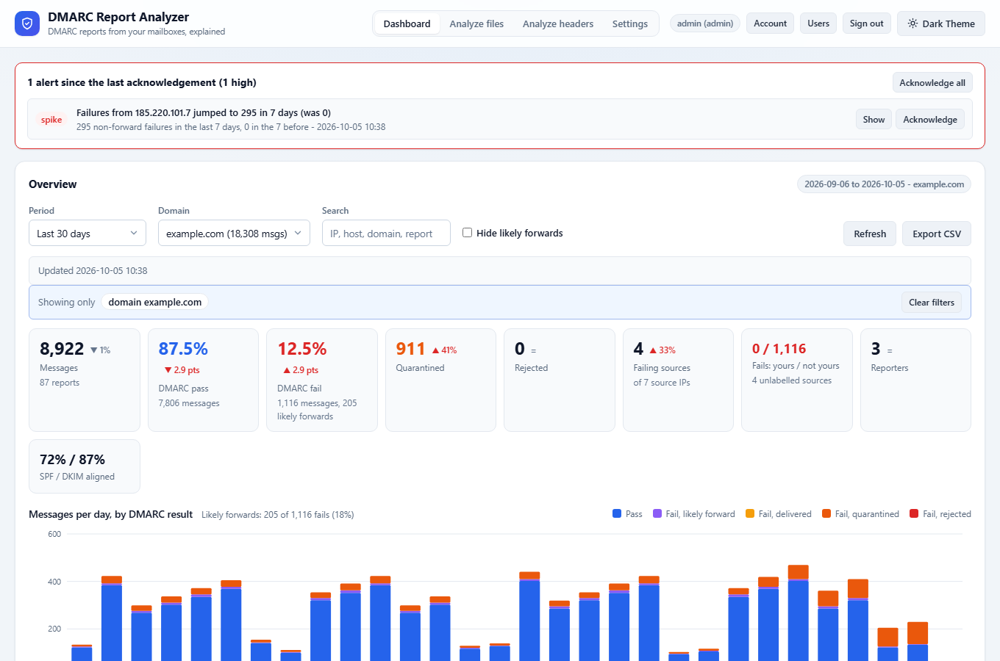
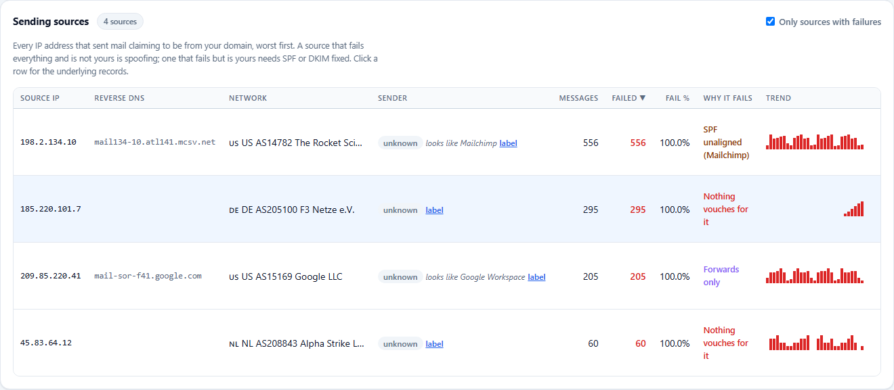
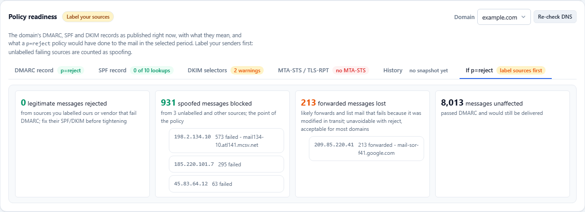
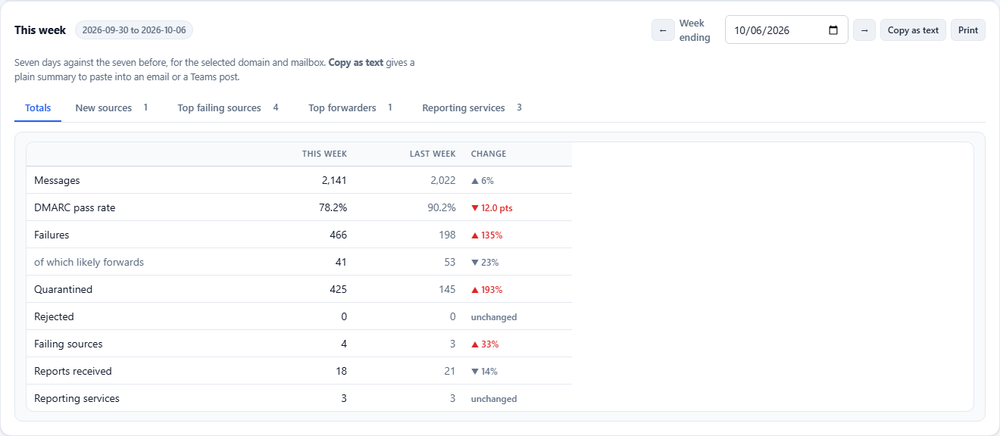
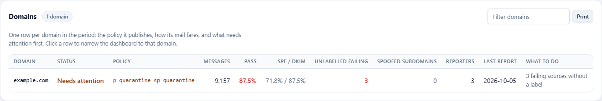
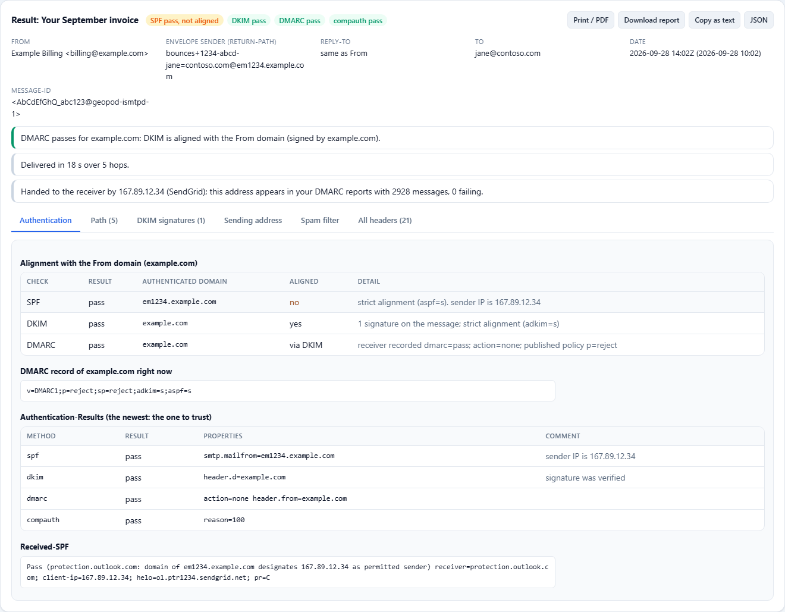
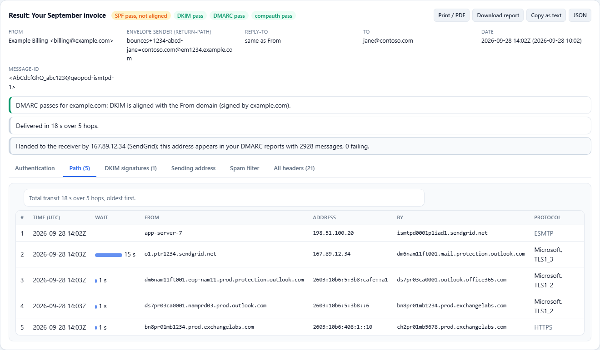
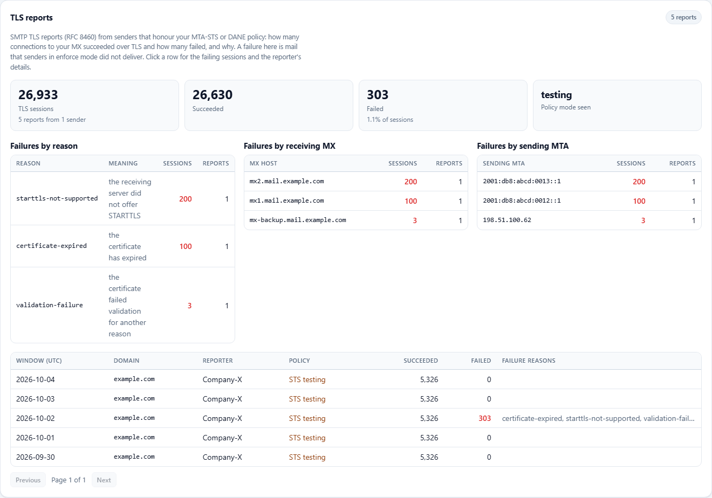
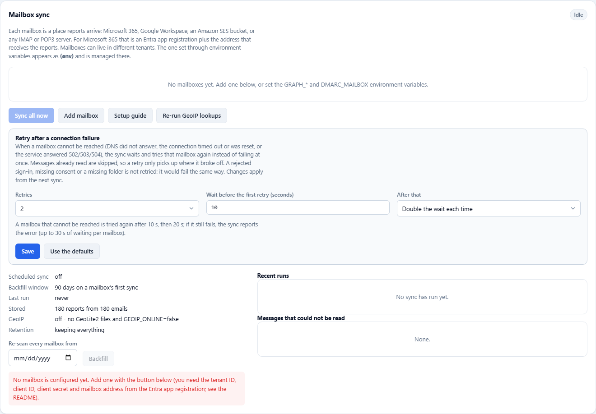
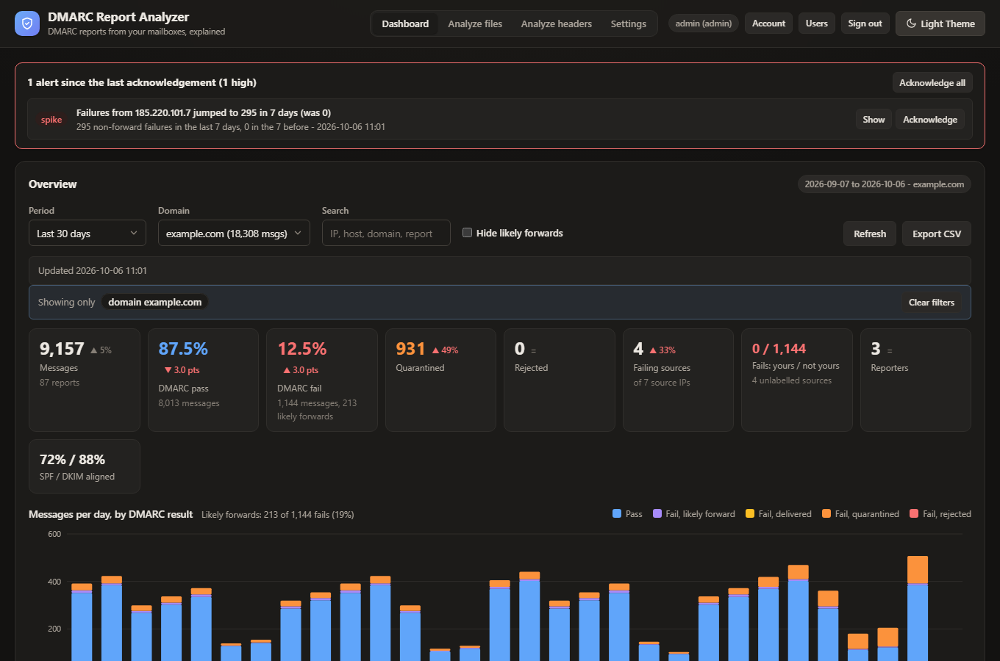

# DMARC Report Analyzer

Small web app that reads DMARC aggregate and forensic reports out of the mailbox they are
sent to (Microsoft 365, Google Workspace, an Amazon SES bucket, or any IMAP or POP3
server), stores them in SQLite, and shows what they say: how much mail failed DMARC, which IP addresses
sent it, when, who reported it, and which domains were involved. Runs as a container on a
management server.



## Screenshots

All taken from a demo dataset (`example.com`, documentation addresses); nothing here is
real mail.

| | |
|---|---|
| **Sending sources**: every address that sent as your domain, with reverse DNS, network, your label or a catalogue guess, why it fails and a 30-day trend.<br> | **Policy readiness**: your DMARC, SPF, DKIM and MTA-STS records checked live, and what `p=reject` would have done to the period's mail.<br> |
| **This week** against last week, ready to copy into an email or print.<br> | **Domains**: one row per domain with its policy, pass rate and what needs attention.<br> |
| **Analyze headers**: paste a message's headers to see why it passed or failed, with alignment recomputed against the From domain.<br> | The same message's **path**, hop by hop with the wait before each. The report exports as PDF, HTML, text or JSON.<br> |
| **TLS reports** (RFC 8460): sessions that succeeded and failed over TLS, by reason, receiving MX and sending MTA.<br> | **Settings**: mailboxes in Microsoft 365, Google Workspace, Amazon SES, IMAP or POP3, with retry options for connection failures.<br> |

Dark theme:



## What it shows

**Overview** for any period and domain: messages seen, DMARC pass and fail percentages,
how many failures were quarantined or rejected, how many source IPs are failing, and a
per-day bar chart of pass vs. fail split by what the receiver did with it.

**Sending sources**: every IP that sent mail claiming your domain, worst first, with
reverse DNS, message and failure counts, what happened to the failures, SPF and DKIM
alignment rates, the SPF/DKIM domains actually seen, which services reported it and when
it was last seen. Click a row for the individual records behind it. A source that fails
everything and is not yours is spoofing; one that fails but is yours needs SPF or DKIM
fixed.

**This week**: seven days against the seven before for the selected domain and mailbox:
messages, pass rate, failures and forwards, quarantined and rejected, failing sources and
reporters, plus the sources that appeared for the first time this week, the top failing
sources and the top forwarders. Step back week by week, and **Copy as text** produces a
plain summary to paste into an email or a Teams post.

**Policy readiness**: for a domain, the DMARC record as published right now with its
tags explained and warnings (no record, `p=none`, `pct` below 100, no `rua`, reports going
to an address the analyzer does not read), the SPF record expanded through its includes
with the DNS-lookup count against the limit of 10, which of your labelled senders fail
SPF and are missing from it, the DKIM selectors seen in reports with whether each still
resolves, its key type and size, and how long it has stood, the transport side (the
**MTA-STS** record and policy file with its mode, max_age and whether every MX host is
covered, the **TLS-RPT** record, and what the period's TLS reports say), the history of
every record the daily snapshot has seen, and **what `p=reject` would have done** in the
selected period: legitimate mail
that would have been rejected (from sources labelled yours or vendor), spoofing that would
have been blocked, and forwards that would have been lost. A domain is called ready when
nothing legitimate would be rejected and every failing source has a label.

**Why it fails**: every source in the Sending sources table gets a one-line verdict, with
the full reasoning and the fix in its drawer: SPF passes only for the sending service's own
domain (the classic mailing-platform case), DKIM signed by another domain, no signature at
all, a labelled sender that nothing vouches for, forwards only, partly failing streams, or
nothing vouching for an unknown source, which is what reject is for. Sources at
well-known services (Microsoft 365, Google Workspace, SendGrid, Mailchimp, Amazon SES,
Postmark, Mailgun and others) are recognised by reverse DNS or network and shown as
"looks like SendGrid" until you label them, which is then one click, and the verdict's
fix names that service's SPF include and where to turn on custom DKIM.

**Domains and subdomains**: mail grouped by the domain actually in the From header
against the domain the report was for, so subdomains stop blending into the parent. Each
row says whether it is the parent, an in-use subdomain (with its pass rate), or a subdomain
that only ever fails, which is one nobody legitimately sends from and therefore spoofing;
it names the policy a receiver applies there (`sp=` when published, otherwise the inherited
`p=`) and, for a spoofed subdomain not yet at reject, says to set `sp=reject`. Clicking a
row narrows the dashboard to that domain.

**Trend at a glance**: each source has a sparkline of its daily volume over the period
(failures in red, bucketed so long periods still fit), and clicking a day in the main
chart narrows the whole dashboard to that day.

**Two pages**: the dashboard holds the analysis panels; **Settings** in the header holds
Mailbox sync, Users and Account, so the dashboard stays short. Every non-default filter
(domain, mailbox, search, hidden forwards) is listed in a "Showing only" strip under the
filter bar with a **Clear filters** button, because a search left over from an alert's
**Show** button or the lookup panel's **Open in sources** otherwise looked like missing data.

**DNS lookup**: check any domain or IP address, whether or not it appears in your reports.
A domain gets its DMARC record (with the same warnings as the policy panel), its SPF record
expanded into the networks it authorises, its MX hosts with their addresses (null MX and
hosts that do not resolve are called out) and its A/AAAA addresses. An IP gets its reverse
DNS with a forward check (a PTR name that resolves back to the address is forward-confirmed,
which is what receivers expect from a mail server) plus what the analyzer already knows about
it: label, report totals, network. Hosts and addresses in the results are clickable to look
them up in turn, and the query is kept in the page link.

**Known senders**: label the sources you recognise so the analyzer can tell "yours" from
"not yours". A pattern is an IP, a CIDR block, a host name or `*.suffix` matched against
reverse DNS; the kind is **ours** (your tenant, your relay), **vendor** (sends on your
behalf) or **other**. Every source is then tagged, the overview splits failures into
yours (fix SPF or DKIM) and not yours (spoofing), and **Import from SPF** resolves your
SPF record through its includes and proposes the networks it authorises, for you to tick
and add. Nothing is added automatically.

**Alerts**: after every sync that adds reports, the analyzer flags a **new source** (an IP
failing DMARC that had never appeared before and is not a known sender), a **spike** (a
source whose non-forward failures in the last 7 days are at least three times the previous
7 days, with at least 20 messages) and, for information, the **first reports** from a new
reporting service. Three more come from the clock rather than from new data (see
[Monitoring](#monitoring)): a **DNS change** when a domain's DMARC, SPF or DKIM record
changes or disappears, a **silent reporter** when a service that used to send daily has
gone quiet, and **no reports** when nothing has been ingested for two days. Open alerts sit
in a banner at the top of the page with a Show button that takes you to the source, the
domain's record history or the reporter, and they stay until someone acknowledges them
(the last two clear themselves when data resumes). The count also appears in the browser
tab title.

**Reporting services**: which receivers (Google, Microsoft, Yahoo, ...) sent reports, how
many, and the failure rate each of them saw.

**TLS reports**: SMTP TLS reports (RFC 8460) arrive in the same mailbox when the domain
publishes a TLS-RPT record, and are parsed from their JSON (plain or gzipped). The panel,
shown once any exist, gives sessions succeeded and failed, the policy mode senders saw
(MTA-STS enforce or testing, DANE, or none), and failures by reason, by receiving MX and by
sending MTA; each report expands to its failing sessions and the JSON can be downloaded.
A failure here is mail a sender in enforce mode did not deliver.

**Analyze files** (its own page): drop one or more reports to look at them with the full
dashboard without storing them. The analysis lives in an in-memory database on the server
that only you can see, is served by the same endpoints under `/api/scratch/<id>/`, and is
dropped after an hour without use or when you discard it. Your known-sender labels and the
reverse-DNS and GeoIP answers already on file are applied, and new IPs are resolved on the
spot, so the sources table reads the same as the live one. While an analysis is open a
banner says so, the mailbox filter and everything that would write to the live store
(labels, acknowledgements, uploads) are hidden, and the page link carries the analysis id
so a reload lands back in it. Any signed-in user can do this, since nothing is saved.

**Analyze headers** (its own page): paste the full headers of one message, or drop a saved
`.eml` (only its header block is read), to see why it passed or failed. The result shows
what the receiving server recorded for SPF, DKIM, DMARC, ARC and Microsoft's composite
authentication, and recomputes alignment with the From domain so "SPF passed but for the
bounce domain" is spelled out; the From domain's DMARC record as published now and what its
policy does to this message; every hop oldest first with the wait before each and the TLS
it used; each DKIM signature with its selector checked in DNS, key size, expiry, `l=` and
whether it covers From; the address that handed the message to the receiver, with reverse
DNS, network, your known-sender label and whether it appears in your DMARC reports; the
Microsoft 365 stamps decoded (SCL, BCL, SFV, CAT, compauth reason, connecting IP) and
SpamAssassin-style markers; and all headers in order. Findings in plain language sit on
top: a disguised display name, a Reply-To in another domain, a slow hop, a signature that
no longer has a key. An Exchange Online trace is prefilled with the Message-ID. The result
can be exported: **Print / PDF** prints the whole report with every section expanded,
**Download report** saves a self-contained HTML file (no scripts, no external requests) to
attach to a ticket, **Copy as text** puts a plain-text version on the clipboard, and
**JSON** saves the raw analysis; each includes the original headers so the reader can
check the conclusions, and all are produced in the browser. The headers
are analysed and returned; they are not stored, logged or put in the page link.

**Upload reports**: writers can drop files on the dashboard instead of (or as well as)
reading a mailbox: aggregate reports as `.xml`, `.xml.gz` or `.zip`, TLS reports as `.json`
or `.json.gz`, and whole emails saved as `.eml` (forensic reports, or messages carrying
report attachments). Files are inspected by content, duplicates are skipped, and the
reports are filed under a "Manual uploads" mailbox so they can be filtered like any other.

**Reports**: every report with its window, reporter, domain, published policy and counts.
Click one for its records; the original XML can be downloaded.

**Search**: one box that narrows every panel at once. It matches source IPs, reverse DNS
names, From and envelope domains, the SPF and DKIM domains seen, reporter names and
report IDs, so typing an IP shows that sender's history and typing a reporter shows only
their reports.

**Hide likely forwards**: DMARC counts forwarded and mailing-list mail as failures, which
buries real spoofing under noise from legitimate relays. Ticking this hides failures that
look like forwards: the reporter tagged them (`forwarded`, `mailing_list`,
`trusted_forwarder`), or a DKIM signature for your own domain was present but no longer
verified, meaning the message was signed by you and altered on the way. A spoofer has no
signature for your domain at all. Forwarded mail that was never DKIM-signed cannot be
told apart from spoofing and stays visible. Such records are also tagged "likely forward"
in every record list.

**Find the emails in Exchange Online**: opening a report shows ready-to-paste queries
for its window, and clicking any individual record (inside a report, or one of the
reports listed under a source IP) shows queries scoped to that record's window and IP:
a `Get-MessageTraceV2` command (the current cmdlet, ExchangeOnlineManagement 3.7.0 or
later; reaches back 90 days, at most 10 days per query, with an exact `-FromIP` filter and
a `Get-MessageTraceDetailV2` follow-up for the hops of one message), a
`Start-HistoricalSearch` command (up to 90 days, emails a CSV, useful for more than 5000
results; it needs a sender, recipient or Message-ID, so a placeholder sender is filled in
unless the record carries one), a Purview content-search KQL string, and the local-time
range to type into the admin center's message trace. The older `Get-MessageTrace` is being
retired by Microsoft and is no longer generated. A trace only sees mail that passed
through your tenant, so it finds outbound mail your Microsoft 365 sent and inbound mail it
received; mail sent from elsewhere straight to another provider never touched Exchange
Online.

**Export**: every record in the selected period as CSV, honouring the search and filters.

**Small things**: every stat tile shows the change against the previous period of the
same length (percentage points for rates, percent for counts), the sources table sorts by
any column, and the URL fragment carries the period, domain, mailbox, search, forwards
switch and any open IP or report, so a view can be bookmarked or pasted to a colleague.

**Mailbox sync**: sync on a schedule or on demand, with live progress, a run history, and a
list of emails whose attachments could not be read. Emails already ingested are skipped, so
re-running is cheap; a backfill option re-scans from any date.

**Printing**: **Domains** and **This week** have a Print button that prints (or saves as
PDF) just that panel, every tab expanded, under a heading with the filter in force and the
date, for handing to someone who does not use the app.

**Labelling help**: when you label a source, the form suggests what to enter: the catalogue
entry when the address or its reverse DNS matches a known service ("looks like SendGrid,
pattern `*.sendgrid.net`"), otherwise a wildcard on the reverse-DNS organisation so the
label covers the sender's whole fleet rather than one address. **Use this** fills the form;
nothing is saved until you add it.

### A note on "times"

Aggregate (`rua=`) reports cover a window, usually one UTC day, and give counts per source
IP. They do **not** contain a timestamp for each message. The times you see here are the
report window and when the report email arrived.

**Forensic reports** (`ruf=`, ARF format) are the exception: one email per failing
message with the exact arrival time, the source IP, the original sender, subject and
Message-ID, and the original headers. The analyzer parses them when a receiver sends
them (few large providers still do) and shows them in a **Forensic reports** panel that
appears only when there are any; each row expands to the headers and an Exchange Online
message trace scoped to the hour around the arrival time with the Message-ID, which is
as precise as a trace gets.

### Accounts

Sign-in with per-user accounts, optional TOTP two-factor and single-use recovery codes.
Administrators manage accounts and can test the mailbox connection, users can start a
sync, viewers can only look. It can also run behind an authentication reverse proxy
(Authelia, Authentik, oauth2-proxy) using the `TRUST_PROXY_AUTH` option.

**Passkeys**: anyone can add passkeys (a phone, a laptop, a hardware key; up to ten),
either under **Account** or right at first sign-in, where the step that offers the
authenticator code offers a passkey beside it: set up one, both or neither. Then use
**Sign in with a passkey** on the sign-in card. No username,
password or code is asked for: the passkey needs the device plus a fingerprint, face or
PIN, which is the same two-factor guarantee TOTP gives the password path. The password
path stays exactly as it is, so a lost device just means signing in with the password and
adding a new passkey. Two things the browser requires: HTTPS (localhost excepted), and
reaching the app by a **hostname**, because a passkey is bound to the domain it was
created on. On plain HTTP or an IP address the passkey button is simply not shown. The
domain and origin are taken from the request; `PASSKEY_RP_ID` and `PASSKEY_ORIGIN`
override them for a proxy that rewrites hosts.

## Requirements

- A mailbox that receives the reports: the address in your domain's DMARC record
  (`v=DMARC1; p=...; rua=mailto:dmarc-reports@example.com`). It can live in Microsoft 365,
  Google Workspace, an S3 bucket fed by Amazon SES, or any IMAP or POP3 server.
- For Microsoft 365: permission to register an application in Microsoft Entra ID and grant
  it admin consent. The other sources are covered under [Other mail sources](#other-mail-sources).
- Docker, or Node 22+.

## Entra app registration

The app reads the mailbox with **application** permissions, so nobody has to stay signed
in and it keeps working unattended.

1. In the [Entra admin center](https://entra.microsoft.com) go to **App registrations**
   and **New registration**. Name it (for example `DMARC Report Analyzer`), leave
   *Accounts in this organizational directory only*, no redirect URI. Register.
2. On the Overview page note the **Application (client) ID** and **Directory (tenant) ID**.
3. **API permissions** → **Add a permission** → **Microsoft Graph** →
   **Application permissions** → tick **Mail.Read** → Add. Then **Grant admin consent**.
4. Give the app a credential. Either kind works, per mailbox:
   - **Client secret**: **Certificates & secrets** → **New client secret**. Copy the
     **Value** immediately; it is shown once. Note the expiry and put a reminder in your
     calendar.
   - **Certificate** (nothing to copy out of the portal, and the private key never leaves
     your server): create a key and a self-signed certificate, then upload the certificate
     under **Certificates & secrets** → **Certificates** → **Upload certificate**.

     ```bash
     openssl req -x509 -newkey rsa:2048 -sha256 -days 730 -nodes \
       -subj "/CN=dmarc-report-analyzer" -keyout graph-key.pem -out graph-cert.pem
     ```

     Upload `graph-cert.pem`; keep `graph-key.pem` private. Entra identifies the
     certificate by its SHA-1 thumbprint, which the app shows next to the mailbox. If you
     already have a `.pfx`, split it into the two PEM files with
     `openssl pkcs12 -in app.pfx -clcerts -nokeys -out graph-cert.pem` and
     `openssl pkcs12 -in app.pfx -nocerts -nodes -out graph-key.pem`. An encrypted key is
     fine too; give the passphrase alongside it.
5. Recommended: restrict the app to just this mailbox. `Mail.Read` as an application
   permission otherwise covers every mailbox in the tenant. In Exchange Online PowerShell:

   ```powershell
   Connect-ExchangeOnline
   New-ApplicationAccessPolicy -AppId <client id> -PolicyScopeGroupId dmarc-reports@example.com -AccessRight RestrictAccess -Description "DMARC analyzer: this mailbox only"
   Test-ApplicationAccessPolicy -AppId <client id> -Identity dmarc-reports@example.com
   ```

   The policy can take up to 30 minutes to apply. `PolicyScopeGroupId` can also be a
   mail-enabled security group if you want to allow several mailboxes.

That gives you the four values the app needs: tenant ID, client ID, the credential (a
client secret, or a certificate and its private key), and the mailbox address.

## Several mailboxes and tenants

Administrators add mailboxes under **Mailbox sync** in the app: a name, the mailbox
address, the tenant ID and client ID of an app registration in that mailbox's tenant, the
credential (**Client secret**, or **Certificate** with the PEM certificate, its private key
and the key's passphrase if it has one), and optionally a folder. Each mailbox is synced on
its own with its own cursor, a failure in one (expired secret or certificate, consent
revoked) does not stop the others, and every report remembers which mailbox it came from.
When more than one is configured a **Mailbox** dropdown joins the filter bar. The mailbox
table shows which credential each one uses and, for certificates, the thumbprint and expiry
date; a certificate within 30 days of expiry is highlighted.

The mailbox given through `GRAPH_*` and `DMARC_MAILBOX` still works and shows up as the
read-only **(env)** entry. Mailboxes added in the app are stored in `mailboxes.json` in
the data directory with their secrets or private keys, so keep that directory private.

## Other mail sources

A mailbox does not have to be in Microsoft 365. **Add mailbox** (and the first-run
walkthrough) start with **Where the reports arrive**, and each mailbox can be a different
type. All of them are read-only: nothing is deleted, moved or marked as read. These types
are configured in the app only; the `GRAPH_*` variables remain the one environment-based
option.

### Google Workspace (Gmail API)

Unattended access uses a service account with domain-wide delegation.

1. In the [Google Cloud console](https://console.cloud.google.com), pick or create a
   project, enable the **Gmail API**, and create a **service account**. Under its **Keys**
   tab add a key of type **JSON** and download it.
2. Note the service account's **Unique ID** (its OAuth client ID).
3. In the [Google Admin console](https://admin.google.com): **Security → Access and data
   control → API controls → Manage domain-wide delegation → Add new**. Enter that client ID
   and the scope `https://www.googleapis.com/auth/gmail.readonly`.
4. In the app choose **Google Workspace**, enter the mailbox address to read, and paste the
   whole JSON key. Optionally give a **label** so only the messages a Gmail filter files
   there are read.

The key is stored with the other mailbox credentials and never shown again; the table shows
the service account's address. A refused token names the delegation setting to check.

### Amazon SES (S3 bucket)

SES does not hold mail. Its inbound receiving delivers each message to an S3 bucket, and
the analyzer reads the bucket.

1. In SES, verify the domain for **email receiving** and point its MX record at the
   region's inbound endpoint. Create a **receipt rule** for the address in your `rua=`
   with the action **Deliver to S3 bucket**, optionally with an object key prefix.
2. Create an IAM user (or role credentials) allowed `s3:ListBucket` on the bucket and
   `s3:GetObject` on its objects, and make an access key.
3. In the app choose **Amazon SES**, and enter the region, bucket, prefix, access key ID and
   secret access key.

Requests are signed with Signature Version 4; no AWS SDK is involved. Objects are never
deleted, so add an S3 lifecycle rule if you want old ones to expire. An **Endpoint** can be
given for S3-compatible storage.

### IMAP

Any server with IMAP: the server name, security (TLS on 993 by default, STARTTLS or none on
143), a username and a password, and the folder to read (`INBOX` by default). Providers
with two-factor need an **app password**. The folder is opened read-only. Certificate
checking can be turned off for a server with a private certificate.

### POP3

The same fields without a folder (TLS on 995 by default, STARTTLS or none on 110). POP3
lists no dates, so every message not seen before is downloaded once, whatever its age, and
recognised afterwards by its unique ID. Messages are never deleted from the server.

## Run it

### Docker Compose

```bash
git clone https://github.com/spicy384/dmarc-report-analyzer.git
cd dmarc-report-analyzer
```

Create a `.env` file next to `docker-compose.yml` so the secret stays out of the compose
file:

```
GRAPH_TENANT_ID=00000000-0000-0000-0000-000000000000
GRAPH_CLIENT_ID=00000000-0000-0000-0000-000000000000
GRAPH_CLIENT_SECRET=the-secret-value
DMARC_MAILBOX=dmarc-reports@example.com
```

For a certificate instead of a secret, put the PEM files in a `certs/` folder next to the
compose file (it is mounted read-only at `/certs`) and point at them:

```
GRAPH_TENANT_ID=00000000-0000-0000-0000-000000000000
GRAPH_CLIENT_ID=00000000-0000-0000-0000-000000000000
GRAPH_CERT_FILE=/certs/graph-cert.pem
GRAPH_KEY_FILE=/certs/graph-key.pem
DMARC_MAILBOX=dmarc-reports@example.com
```

Then:

```bash
docker compose up -d
```

Open <http://localhost:3000> and create the first administrator. If no mailbox is
configured yet (no `GRAPH_*` variables and none added in the app), a four-step
walkthrough opens right after sign-in: what to collect from Entra, the app registration
and its credential (secret or certificate), the mailbox, then a connection test with a
plain-language reading of any failure and a button to run the first sync. **Skip for now**
puts it away; **Setup guide** under Mailbox sync reopens it at any time. Otherwise check
the **Mailbox sync** panel: **Test** confirms the token and the folder, **Sync all now**
pulls the reports. The first sync looks back `BACKFILL_DAYS` (90 by default); later runs continue
from the newest email seen, and a scheduled run happens every `SYNC_INTERVAL_MINUTES`.

The compose file publishes the port on loopback only, because the app serves plain HTTP.
For anything reachable from other machines put it behind HTTPS: `deploy/caddy` is a
ready-made setup with automatic Let's Encrypt certificates, and the section below covers
the app's own TLS.

### Without Docker

```bash
npm install
GRAPH_TENANT_ID=... GRAPH_CLIENT_ID=... GRAPH_CLIENT_SECRET=... DMARC_MAILBOX=... node server.js
```

Data lives in `./data` unless `DATA_DIR` says otherwise.

## Configuration

| Variable | Default | Purpose |
|---|---|---|
| `GRAPH_TENANT_ID` | | Directory (tenant) ID of the app registration |
| `GRAPH_CLIENT_ID` | | Application (client) ID |
| `GRAPH_CLIENT_SECRET` | | Client secret value (leave unset when using a certificate) |
| `GRAPH_CERT_FILE` | | Path to the certificate PEM; may hold the key too. Used instead of the secret |
| `GRAPH_KEY_FILE` | | Path to the private key PEM, when it is a separate file |
| `GRAPH_KEY_PASSPHRASE` | | Passphrase of the private key, if it is encrypted |
| `GRAPH_CERT_PEM`, `GRAPH_KEY_PEM` | | The same as inline PEM text, for setups that inject secrets as variables |
| `DMARC_MAILBOX` | | The mailbox receiving reports, as a UPN / email address |
| `DMARC_FOLDER` | `Inbox` | Folder to read. A display name, or a `Parent/Child` path |
| `SYNC_INTERVAL_MINUTES` | `60` | Scheduled sync interval. `0` turns it off; **Sync now** still works |
| `BACKFILL_DAYS` | `90` | How far back the very first sync looks |
| `RETENTION_MONTHS` | `0` (keep all) | Roll up reports older than this many months into daily totals |
| `GEOIP_CITY_DB`, `GEOIP_ASN_DB` | `<data>/geoip/GeoLite2-*.mmdb` | MaxMind database files, if you have them |
| `GEOIP_ONLINE` | `true` | Fall back to ip-api.com for IPs the files cannot answer |
| `PORT` | `3000` | Listening port |
| `PASSKEY_RP_ID`, `PASSKEY_ORIGIN` | from the request | Domain and origin passkeys are bound to, when a proxy hides the real ones |
| `APP_URL` | where settings were saved from | Link back to the app in webhook notifications |
| `DATA_DIR` | `./data` | Accounts, sessions, the SQLite database, generated TLS files |
| `TZ` | `UTC` | Timezone for the container |
| `COOKIE_SECURE` | `false` | Mark the session cookie Secure. Set `true` behind HTTPS |
| `TLS_ENABLED` | `false` | Serve HTTPS with a generated self-signed certificate |
| `TLS_HOSTS` | | Extra names/IPs for that certificate, comma separated |
| `TLS_CERT`, `TLS_KEY` | | Use your own certificate instead |
| `TRUST_PROXY_AUTH` | `false` | Accept the user from a reverse-proxy header (see below) |
| `PROXY_USER_HEADER` | `remote-user` | Which header carries the username |

Nothing in the mailbox is changed: the app only reads. It remembers which emails it has
ingested by their Graph message ID, and a report delivered twice (same reporter, report ID
and domain) is stored once.

### Retention

Everything is kept by default. Under **Settings → Backup and maintenance → Retention**
(administrators) choose how many months of full detail to keep, or set `RETENTION_MONTHS`
as the starting value; a value saved in Settings overrides the environment and applies
without a restart. Saving only stores the choice: the roll-up happens at the next daily
pass, or at once with **Apply now**, and both ask first when the change would delete
detail. Reports older than the period are rolled
into daily totals: their individual records and stored XML are removed, the report rows
stay (marked as rolled up), and totals, the chart and the weekly view still cover the
full history. Sources, records, search, the CSV export and XML downloads only cover
retained data, and the overview says so when the selected period reaches further back.
The pass runs 30 seconds after start and then daily.

### Retrying after a connection failure

A mailbox that cannot be reached (DNS did not answer, the connection timed out or was
reset, or the service answered 502/503/504) is tried again after a wait instead of
failing the sync at once: by default twice, after 10 and then 20 seconds. **Settings →
Mailbox sync → Retry after a connection failure** sets the number of retries (0 to 5,
0 switches it off), the first wait (1 to 600 seconds) and whether the wait doubles or
stays the same, and shows what the choice amounts to. Messages already read are skipped,
so a retry only picks up where it broke off. A rejected sign-in, missing consent or a
missing folder is not retried. Network errors now say why they failed (the low-level
code, the host, and what it usually means) instead of "fetch failed".

### Country and network of source IPs

Every source IP is looked up for country, city and network (ASN) after each sync, shown
in the **Network** column and searchable. Two sources, files preferred:

- **MaxMind GeoLite2 files**, read locally so no IP leaves your network. Set them up under
  **Settings → GeoIP** (administrators): create a free MaxMind account, generate a license
  key, enter the account ID and key, and **Download now** fetches `GeoLite2-City` and
  `GeoLite2-ASN`, checks each is a readable database of the right kind, and starts using
  them without a restart. With **Check for newer files every week** on, the app asks
  MaxMind weekly whether the files changed and downloads only when they did. The key is
  stored in the database (so it is in backups) and never shown again. A server that cannot
  reach MaxMind can **upload** the files instead (`.mmdb`, or the `.tar.gz` MaxMind
  provides); copying them into `geoip/` inside the data directory (`/data/geoip`, or
  wherever `GEOIP_CITY_DB` and `GEOIP_ASN_DB` point) still works too. The panel shows
  each file's build date and size, and **Re-run lookups for every address** resolves
  everything again.
- **ip-api.com**, used for whatever the files cannot answer, or for everything when there
  are no files. It is queried over plain HTTP in batches of 100, at most 15 requests a
  minute, and its free tier is for non-commercial use; every unknown source IP is sent to
  it. Switch it off with the checkbox on the same Settings panel (or `GEOIP_ONLINE=false`
  as the default) to keep every address on the server.

### What gets ingested

Every email with attachments in the folder. Each attachment is inspected by content, not by
name or type, since senders mislabel them: `.zip` (one or more XML files inside), `.xml.gz`
and bare `.xml` are all handled, as is a zip inside a gzip, and TLS reports (RFC 8460) as
`.json` or `.json.gz`. Attachments that are neither (logos, signatures, calendar items)
are ignored; an email with none is recorded as "no report" and not looked at again. An
email whose report is malformed is listed under **Messages that could not be read** with
the reason. Files uploaded by hand go through exactly the same path (`ingest.js`).

## HTTPS and reverse proxies

The app serves plain HTTP by default. Three options, in order of preference:

1. **A reverse proxy on the same host** (Caddy, Traefik, Nginx Proxy Manager) on a shared
   Docker network, with the app publishing no ports at all. `deploy/caddy` does exactly
   this with automatic certificates. Set `COOKIE_SECURE=true`.
2. **A proxy on another host.** Set `TLS_ENABLED=true` and list the address the proxy
   connects to in `TLS_HOSTS`, so the hop between them is encrypted with a self-signed
   certificate. Proxies do not verify upstream certificates by default.
3. **Your own certificate** via `TLS_CERT`/`TLS_KEY`, mounted read-only.

### Behind an authentication proxy

If Authelia, Authentik or oauth2-proxy already protects the app, set
`TRUST_PROXY_AUTH=true` and the app trusts the username in `PROXY_USER_HEADER`. The user
must still exist locally (create them under **Users**); the proxy asserts who they are, not
whether they may use the app. Only do this when the proxy strips that header from client
requests and the app is reachable through nothing else, because otherwise anyone who can
reach the port can be anyone.

## Data

Everything is under `DATA_DIR` (`/data` in the container):

- `dmarc.sqlite` - reports, records, messages seen, reverse-DNS cache, sync history. The
  original XML of every report is kept (gzipped) so it can be downloaded or re-parsed.
- `users.json`, `sessions.json` - accounts (scrypt password hashes, TOTP secrets, hashed
  recovery codes) and sessions.
- `tls/` - the generated certificate when `TLS_ENABLED=true`.

Back up the directory; treat it as sensitive.

## Notifications

**Settings → Notifications** (administrators) posts new alerts after each sync and the
weekly summary on a chosen day and hour to an incoming webhook: a **Microsoft Teams**
workflow ("Post to a channel when a webhook request is received", which receives an
Adaptive Card), a **Slack** app's incoming webhook (Block Kit), or any **generic**
endpoint that accepts JSON (`{ event, title, text, lines, link, sentAt }`). No new
permissions are needed anywhere. The URL is a credential: it is stored, shown only as its
host afterwards, and never logged. **Send a test message** confirms delivery and **Send
the weekly summary now** posts the current week on demand. The last delivery result is
shown on the panel. `APP_URL` sets the link back to the app in each message; otherwise the
address you saved the settings from is used.

**Domains**: the first panel on the dashboard gives one row per domain with its published
policy, pass rate, SPF and DKIM pass, failing sources without a label, spoofed subdomains
not yet at reject, reporters and last report, and a status with the reasons: healthy,
needs attention, or not enforced (`p=none`). A domain that stopped reporting for over a
week is flagged too.

## Monitoring

Some problems show up as an absence: a broken `rua=` address means fewer reports, not
more failures, and an SPF record someone edited by hand is wrong long before the failures
climb. So, besides the checks that run on new data, the analyzer keeps a clock:

- **DNS record drift.** Once a day it looks up the DMARC, SPF, MTA-STS and TLS-RPT records
  of every domain that reported in the last 90 days, fetches the MTA-STS policy file, and
  checks the DKIM key of every selector seen signing for them in the last 30 days. Each
  distinct value is stored in a history with the window it
  was seen in (the **History** tab of the Policy panel shows it, and the DMARC, SPF and
  DKIM tabs say how long the current value has stood). The first snapshot is the baseline;
  after that a changed record is an alert, a vanished one a high alert, and a DMARC change
  that weakens the policy (`p=` loosened, `pct=` lowered) or an MTA-STS policy that drops
  from enforce to testing is high too. A resolver failure, or a policy file that could not
  be fetched, is never read as "the record is gone".
- **Silent reporters.** A reporting service that had sent at least 7 reports in its last
  30 days with no more than two days between report days, and has then sent nothing for
  4 days, is flagged. That usually means the `rua=` address, a mailbox rule or the
  connection broke, not that mail stopped.
- **Stalled ingestion.** No report stored for 48 hours while a mailbox is enabled (and at
  least ten reports exist) is flagged, with each mailbox's last sync and error.

The last two run after every sync and once an hour, and resolve themselves when reports
resume. **Settings → Monitoring** (administrators) shows the last snapshot, the tracked
domains and the thresholds, and **Run the checks now** runs everything on demand. New
alerts go to the webhook like any other.

The DKIM tab of the Policy panel also reports key hygiene: the key size parsed from `p=`
(RSA keys under 2048 bits are flagged; Ed25519 is accepted), `t=y` testing mode, revoked
keys, selectors that sign mail but have no key in DNS, and keys unchanged for over a year.

## Versions and updates

The footer shows the running version (from `package.json`) and, in the container, the
commit and build date baked in by the workflow. Once a day the app lists the image's tags
on GitHub Container Registry and, when a higher release than its own is published, the
footer says so with the `docker compose pull` to run; administrators can **Check now**.
Only the image name goes over the wire. To switch the check off, untick **Check daily for
a newer release** under **Settings → Version and updates** (administrators; takes effect at
once and is remembered), or set `UPDATE_CHECK=false` in the environment, which wins and
locks the checkbox. Set
`UPDATE_IMAGE` if you publish the image under another name.

Releases are git tags: `git tag v1.2.3 && git push origin v1.2.3` builds and publishes
`ghcr.io/spicy384/dmarc-report-analyzer:1.2.3` (and `:1.2`) from that commit, next to the
`:latest` that every push to `main` produces. Bump `version` in `package.json` in the same
commit so the footer and the update check agree. Dependabot opens weekly pull requests for
npm dependencies and GitHub Actions versions.

## Hardening

Besides the per-account lockout (five wrong passwords or codes lock the account for 15
minutes), every endpoint that takes a credential while signed out (`/api/auth/setup`,
`/api/auth/login`, its MFA and recovery steps, passkey sign-in) is throttled per client
address: twenty failed attempts in 15 minutes answer `429` with `Retry-After` until the
window passes. Successes never count, so a shared office address only pays for its own
mistakes. Behind a reverse proxy the first `X-Forwarded-For` hop is the address.
`LOGIN_RATE_LIMIT` changes the number; `0` switches it off.

Every response carries a Content-Security-Policy (`default-src 'self'`; scripts only from
the app itself; inline styles allowed because the chart sets them from JavaScript; `data:`
images for the authenticator QR code; no framing), `X-Content-Type-Options: nosniff`,
`X-Frame-Options: DENY`, `Referrer-Policy: same-origin` and a Permissions-Policy that
switches off camera, microphone, geolocation and payment.

## Sessions and the audit log

**Account → Sessions** lists everywhere your account is signed in (browser, address, when
signed in, last active), lets you end any other session, **Sign out other devices**, or
**Sign out everywhere** including this one. Sessions still expire after 8 hours idle or 7
days regardless.

**Settings → Audit log** (administrators) records who did what: sign-ins with the method
used (password, authenticator code, recovery code, passkey), sign-outs and sessions ended,
users added, removed or given another role, two-factor enrolled, disabled or reset,
passwords changed, passkeys added or removed, mailboxes added, changed (naming the fields)
or removed, known-sender labels added, changed or removed, backups downloaded and restored,
and re-processing runs. Each entry carries the username, the target, a detail line with no
secrets, and the client address. It is kept in the database and a restore leaves it in
place. Filter by category, and load older entries page by page. `GET /api/audit` returns
the same data.

## Backup, restore and re-processing

**Settings → Backup and maintenance** (administrators). **Download backup** produces a
`.tar.gz` (plain tar, so `tar -xzf` opens it) holding a consistent online-backup copy of
the SQLite database plus `users.json` and `mailboxes.json`. It contains password hashes,
TOTP secrets and mailbox credentials, so keep it private. Sessions and GeoLite2 files are
not included. **Restore from file** replaces every report, record, label, alert and setting
with the backup's and overwrites the accounts and mailboxes; nothing is merged, the backup
is upgraded to the current schema first, and a bad archive changes nothing. The audit log
is the one table that stays, since it is this instance's history. If your own account is
not in the backup you are signed out. **Re-process all reports** parses every stored
report again with the current parser and rewrites its records, so a parser improvement
applies to reports you already have; reports rolled up by retention no longer have their
XML and are skipped. It runs in the background in small batches.

## Tests

```bash
npm test
npm run lint
```

Twenty-five plain-Node suites, no test framework: the parser (containers and XML shapes
from the samples in `examples/`), TLS reports and the shared ingest path, one-time
analyses (isolation, enrichment, expiry), storage,
verdicts, DNS (including MTA-STS against a fake policy host), Graph with certificates, the
mailbox store, the other mail sources against mock POP3, IMAP, Gmail and S3 servers, alerts,
monitoring (record drift, silent reporters, stalled ingestion against a scripted zone),
GeoIP, retention, backup and restore, notifications, the ingest job against a mock Graph
server, the HTTP API, and the accounts, sessions, TOTP and passkey flow against the real
server. ESLint checks the server, the tests and the browser scripts; warnings fail the
run.

There is also one browser test (`npm run e2e`, Playwright with Chromium, after
`npx playwright install chromium` once): it starts the app against a seeded, throwaway
data directory (`test/e2e/serve.js`), creates the first administrator, tours the dashboard,
clicks through the Policy tabs, opens a report, uploads a file on the Analyze page and
checks the Settings page, failing on any console error. It is the one place the browser
scripts are exercised for real, so a broken panel fails CI instead of the next refresh.

The screenshots above are generated, not hand-made: `npm run screenshots` starts the app
on a throwaway data directory filled with a synthetic demo dataset
(`test/e2e/demo-seed.js`), drives it with Chromium and rewrites `docs/screenshots/`. Run
it after a visible change to keep the README current.

The GitHub workflow runs lint, the suite and the browser test on every push and pull
request, and only builds and publishes the image when they pass.

### Code layout

Server modules sit in the repository root, one concern each (`db.js`, `sync.js`,
`graph.js`, `source-*.js`, `ingest.js`, `tlsrpt-parser.js`, `scratch.js`, `verdict.js`,
`alerts.js`, `monitor.js`, `backup.js`, `notify.js`, ...). The report-reading endpoints
sit on one Express router that takes its database from `req.db`, mounted under `/api` for
the live store and under `/api/scratch/:id` for a one-time analysis. The browser side
has no build step: `public/js/` holds numbered classic scripts that `index.html` loads in
order into one shared global scope, one file per panel or concern, so a function defined
in an earlier file is visible to later ones. `eslint.config.js` collects their top-level
names so cross-file references are still checked.

## Ideas not built

- Alerting by email (alerts are in-app and over webhooks).
- Full ASN-level roll-ups of sources (each IP is shown with its network; there is no
  per-network view).
